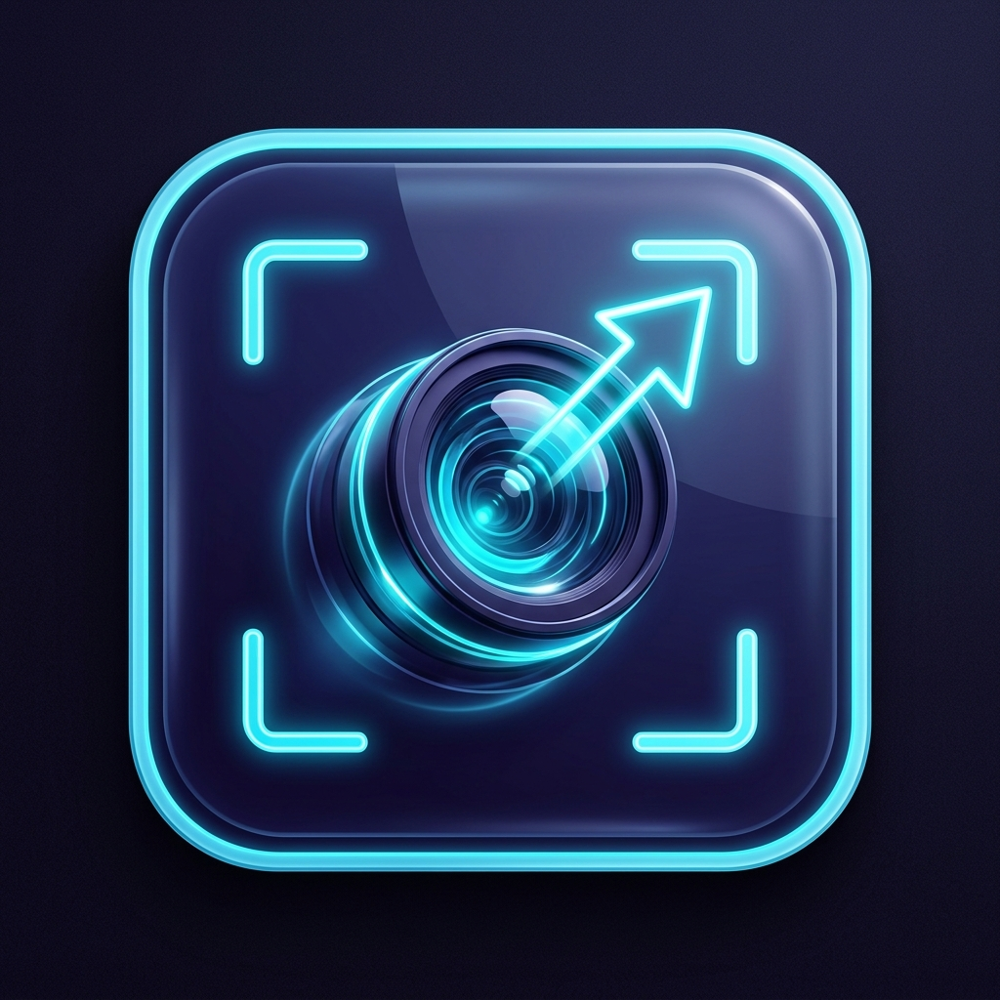

# 📷 BCC ScreenShot Studio



**BCC ScreenShot Studio** — нативное высокопроизводительное десктопное приложение для Windows (.NET 10 / WPF), предназначенное для быстрого захвата экрана, выделения областей и наложения векторных аннотаций (стрелки, рамки, текст, цензура, нумерованные шаги).


---

## 🌟 Основные возможности

### 📸 Захват и кадрирование экрана
- **✂️ Захват рамкой (Region Snippet)**: Полноэкранный оверлей для выделения произвольной прямоугольной области экрана любого размера.
- **📸 Весь экран**: Мгновенный снимок всех мониторов.
- **📁 Импорт**: Загрузка любых стандартных изображений (PNG, JPG, BMP).
- **🖼️ Демо-снимки**: Встроенный генератор тестового интерфейса для быстрого ознакомления с инструментами.

### 🎨 Графические инструменты и аннотации
- **↗️ Векторные стрелки (`A`)**: Указки с авто-формированием острого наконечника и регулируемой толщиной.
- **🔲 Рамки (`R`) / ⭕ Овалы (`E`) / 📏 Линии (`L`)**: Выделение ключевых зон и блоков.
- **🔤 Редактируемый текст (`T`)**: Полноценный текст с контрастной фоновой подложкой. **Двойной клик** открывает редактирование прямо на холсте.
- **🔢 Нумерованные метки шагов (`N`)**: Авто-инкрементируемые маркеры `1`, `2`, `3`... для построения пошаговых гайдов.
- **✏️ Карандаш (`P`) & 🖍️ Маркер (`H`)**: Произвольное рисование и полупрозрачная подсветка.
- **💧 Инструмент размытия (`B`)**: Пикселизация / цензура личных данных и паролей.
- **↖ Режим выбора & Перемещения (`Esc`)**: Зажмите ЛКМ на любом объекте, чтобы переместить его по холсту.

### 📋 Интеграция с Windows
- **Буфер обмена (`Ctrl + C`)**: Мгновенное копирование скриншота в системный буфер обмена Windows для быстрой вставки (`Ctrl + V`) в Telegram, WhatsApp, Word или в почту.
- **Сохранение в PNG (`Ctrl + S`)**: Сохранение изображения на диск.
- **Отмена действий (`Ctrl + Z`)**: История операций.

---

## ⌨️ Горячие клавиши

| Сочетание | Действие |
| :--- | :--- |
| `Esc` | Сброс активного инструмента на режим выбора («↖ Выбор») |
| `Delete` / `Backspace` | Мгновенное удаление выделенного элемента |
| `Double Click` | Редактирование текста по двойному клику |
| `Ctrl + C` | Скопировать изображение в системный буфер обмена Windows |
| `Ctrl + S` | Сохранить скриншот как PNG |
| `Ctrl + Z` | Отменить последнее действие |

---

## 🛠️ Сборка и запуск из исходников

### Требования
- ОС: **Windows 10 / 11**
- SDK: **.NET 10.0 SDK** (или новее)

### Сборка проекта
```bash
# Клонировать репозиторий
git clone https://github.com/Nesterro/BCC-ScreenShots.git
cd BCC-ScreenShots

# Восстановление и сборка
dotnet restore
dotnet build

# Запуск приложения
dotnet run
```

### Публикация готового .exe файла
```bash
dotnet publish -c Release -o ./BuildRelease
```
Исполняемый файл будет доступен по пути `BuildRelease/BCCScreenShot.exe`.

---

## 📄 Лицензия

Распространяется по лицензии **MIT**. Свободно для использования и модификации.
